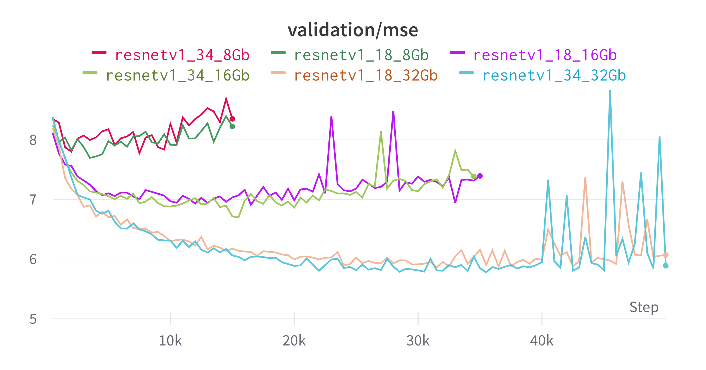
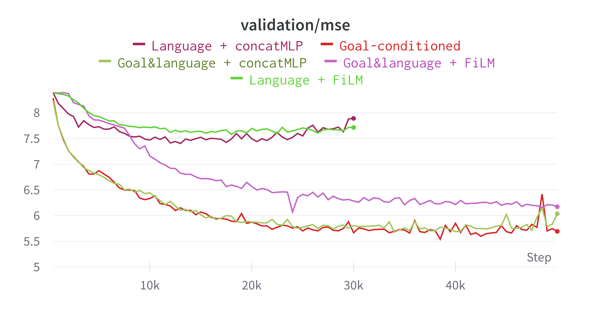

# Jax BC/RL Implementations for BridgeData V2
This repository provides code for training on BridgeData V2 dataset.

This code is forked from [rail-berkeley/bridge_data_v2](https://github.com/rail-berkeley/bridge_data_v2). So for more detailes go in that repo.

Added implementation of language-conditioned behavioral cloning.

## Environment

The dependencies for this codebase can be installed in a conda environment:

```
conda create -n jaxrl python=3.10
conda activate jaxrl
pip install -e . 
pip install -r requirements.txt
```
For GPU:
```
pip install --upgrade "jax[cuda11_pip]==0.4.13" -f https://storage.googleapis.com/jax-releases/jax_cuda_releases.html
```

For TPU
```
pip install --upgrade "jax[tpu]==0.4.13" -f https://storage.googleapis.com/jax-releases/libtpu_releases.html
```
See the [Jax Github page](https://github.com/google/jax) for more details on installing Jax. 

## Training

To start training run the command below. Replace `METHOD` with one of `gc_bc`, `gc_ddpm_bc`, `gc_iql`, or `contrastive_rl_td`, and replace `NAME` with a name for the run. 

```
python experiments/train.py \
    --config experiments/configs/train_config.py:METHOD \
    --bridgedata_config experiments/configs/data_config.py:all \
    --name NAME
```

Training hyperparameters can be modified in `experiments/configs/data_config.py` and data parameters (e.g. subsets to include/exclude) can be modified in `experiments/configs/train_config.py`. 

## Experiments and Results

### Dataset Configurations

Three different dataset sizes were utilized for experiments, each containing a varying set of skills and environmental settings:

- **8 GB Dataset**: Includes tasks such as sweeping, stacking, opening/closing microwaves, and pick-and-place operations.
  
  **Folders**: minsky_folding_table_white_tray, deepthought_toykitchen1, deepthought_toykitchen2
  
- **16 GB Dataset**: Extends the 8 GB dataset with additional tasks like opening and closing drawers.
  
  **Folders**: minsky_folding_table_white_tray, deepthought_toykitchen1, deepthought_toykitchen2, deepthought_robot_desk, deepthought_folding_table
  
- **32 GB Dataset**: Further extends the 16 GB dataset by adding a pushing task.
  
  **Folders**: Includes all folders from the 16 GB dataset plus datacol2_toysink2, datacol2_toykitchen7_white_tray, and datacol2_toykitchen7.

### Model Architectures

Two different encoding model backbones were employed in our experiments:

- **resnetv1-18**
- **resnetv1-34**

### Goal-conditioned Behavioral Cloning (GCBC)

A total of six experiments were conducted, involving various combinations of dataset sizes and model architectures. The results, particularly those related to Mean Squared Error (MSE) on the validation dataset, are as follows:



#### Key Takeaways:

- Increasing the dataset size enhances the model's ability to generalize, thereby reducing the total error on validation data.
  
- With smaller datasets, the model architecture doesn't significantly impact the error. However, with the 32 GB dataset, the larger model (resnetv1-34) already slightly outperforms its smaller counterpart.

For a more detailed breakdown of the MSE error plots, you can visit our [Weights & Biases dashboard](https://api.wandb.ai/links/4ku/68se6a6c).

#### MSE Results Summary Table:

| Configuration           | Best MSE on Validation Dataset |
|-------------------------|--------------------------------|
| Random Policy           | 8.758                          |
| resnetv1_18 + 8 GB      | 7.697                          |
| resnetv1_34 + 8 GB      | 7.776                          |
| resnetv1_18 + 16 GB     | 6.911                          |
| resnetv1_34 + 16 GB     | 6.698                          |
| resnetv1_18 + 32 GB     | 5.863                          |
| resnetv1_34 + 32 GB     | 5.779                          |
| resnetv1_34 + Full Data | 4.194                          |

### Language-conditioned Behavioral Cloning (LCBC)

In the 32 GB dataset, a total of 7,978 trajectories exist, of which 6,518 are accompanied by language prompts. These language-annotated trajectories serve as the focus for experiments involving Language-conditioned Behavioral Cloning.

#### Dataset Overview:
- **Trajectories Paired with Language Prompts**: 6,518
- **Total Trajectories Available**: 7,978

#### LCBC Implementation Details:
The Language-conditioned Behavioral Cloning was conceptualized based on the description presented in the BridgeData V2 paper:

```
The natural language instruction is first encoded using the MUSE sentence embedding, then the image observation is encoded using a ResNet-34 with FiLM conditioning on the language encoding.
```

The pretrained universal sentence encoder was sourced from [this location](https://tfhub.dev/google/universal-sentence-encoder/4).

Notably, experiments were also conducted without the use of FiLM. Instead of FiLM conditioning, the language and observation encodings were simply concatenated.

#### Validation Results:
The MSE plots for validation data are visualized in the provided image below, and they are also available on [Weights & Biases dashboard](https://wandb.ai/4ku/jaxrl_m_bridgedata/reports/validation-mse-23-09-07-10-39-37), juxtaposed with the results from goal-conditioned BC. 
  
  

#### Key Takeaways:
- LCBC showcases its ability to learn effectively.
- Simple concatenation outperforms FiLM concatenation in our setting.
- Although experiments were performed combining both goal and language conditions in BC, there wasn't a noticeable improvement over the traditional goal-conditioned BC. This might be attributed to the fact that the pretrained universal sentence encoder is quite general and may not offer significant advantages in goal conditioning.

#### MSE Results Summary Table:

| Configuration                    | Best MSE on Validation Dataset |
|----------------------------------|--------------------------------|
| Language + FiLM                  | 7.578                          |
| Language + concatMLP             | 7.404                     |
| Goal & Language + FiLM           | 6.07                      |
| Goal & Language + concatMLP      | 5.681                     |
| Traditional Goal-conditioned BC  | 5.54                      |

